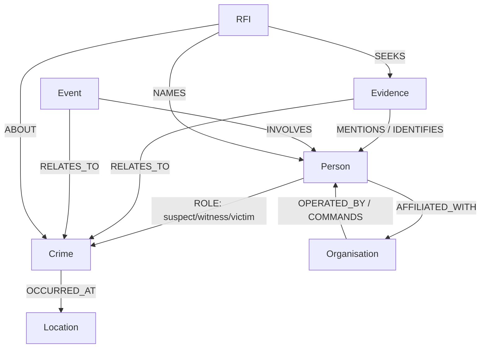

<!--  -->

[https://nocodb.com/](https://nocodb.com/)

# Investigation Management Systems (IMS)
**Overview for Human Rights & Investigative Legal Work (UK)**

> This document provides a practical overview of Investigation Management Systems (IMS) for moving thousands of spreadsheet records into a secure, queryable database that supports human-rights and investigative-legal workflows in the UK.

---

## 🎯 Purpose
Replace spreadsheet-based tracking with a robust IMS that:
- Links **People ↔ Crimes ↔ Evidence ↔ Organisations ↔ Events/Locations** for accountability.
- Manages large volumes of structured and unstructured information for investigators.
- Visualises connections (link charts) and geography (maps/GIS).
- Handles **RFIs (Requests for Information)** with auditability and controlled disclosure.

---

## ✅ Your Goals → How an IMS Addresses Them

1) **Associate a Person with a Crime (for accountability & justice)**  
   - Use a domain model with entities (Person, Crime, Role, Evidence, Organisation, Event).  
   - Record roles (e.g., *suspect, witness, victim, commander, perpetrator, facilitator*).  
   - Maintain provenance and chain-of-custody for each item of evidence.  
   - Produce legally defensible exports/bundles (with hashes and audit trails).  

2) **Manage a huge amount of information for investigators**  
   - Full-text search across documents, transcripts, media, and notes.  
   - Structured metadata (source, reliability, sensitivity, classification).  
   - Work queues, tasking, and review workflows.  
   - De-duplication and entity resolution (merge duplicate people/entities).  

3) **Map and see connections in a crime**  
   - **Link analysis** (network graphs for people–events–organisations–crimes).  
   - **GIS maps** for locations, hotspots, routes, and cross-border patterns.  
   - Temporal views (timelines) for incidents and communications.  

4) **Deal with RFIs (Request for Information)**  
   - Intake, triage, and track RFIs (from courts, oversight bodies, NGOs, journalists).  
   - Apply disclosure rules and redaction policies.  
   - Controlled exports with minimum-necessary data, access logs, and legal hold.  

---

## 🧠 Core Concepts & Data Model

### Key Entities
- **Person** (identifiers, aliases, roles, affiliations)
- **Crime / Incident** (type, date/time, location, modus operandi, legal classification)
- **Evidence** (documents, media, testimonies, digital captures; hash, source, chain-of-custody)
- **Organisation / Unit** (membership, command structure)
- **Event** (meetings, movements, communications)
- **Location** (geocoded points, polygons—sites, routes, facilities)
- **RFI** (requestor, scope, status, due dates, disclosure package links)

### Relationship-First View (Mermaid)

### Minimal Relational Schema (indicative)
- `persons(id, full_name, dob, nationality, identifiers, risk_level)`  
- `crimes(id, type, legal_basis, occurred_at, location_id, summary)`  
- `person_crime_roles(id, person_id, crime_id, role, confidence, source_id)`  
- `evidence(id, kind, filename, sha256, source, captured_at, custody_log, sensitivity)`  
- `evidence_links(id, evidence_id, subject_type, subject_id, relation)`  
- `organisations(id, name, type, country, parent_org_id)`  
- `events(id, occurred_at, location_id, summary)`  
- `locations(id, name, lat, lon, geojson)`  
- `rfi(id, requester, basis, scope, received_at, due_at, status)`  
- `rfi_items(id, rfi_id, subject_type, subject_id, redaction_policy, export_id)`  
- `audit_log(id, actor, action, subject_type, subject_id, at, details)`  

> For complex networks, a **graph database** (e.g., Neo4j) alongside Postgres is highly effective for link analysis.

---

## 🧩 Key Capabilities (What Good IMSs Do)

### 1) Case, Entity & Evidence Management
- Create cases; link people, crimes, orgs, and events.
- Attach files and metadata; store hashes (e.g., SHA-256) for integrity.
- Chain-of-custody and provenance for admissibility.
- Versioning and immutable audit trails.

### 2) Search, Analysis & Visualisation
- Full-text search across documents and transcripts.
- Link charts/network graphs for relationships.
- Mapping/GIS: geocode incidents; draw areas of operations; heatmaps.
- Timelines for incident sequences and communications.

### 3) Workflows & Collaboration
- Task assignment, review queues, approvals.
- Role-based access control (RBAC), granular permissions.
- Watchlists and notifications for changes on key entities/cases.

### 4) Disclosure & RFI Handling
- Register RFIs; capture legal basis and scope.
- Identify responsive records; apply redaction policy.
- Export bundles with cover sheets, indexes, and checksums.
- Maintain RFI-specific audit logs and access records.

---

## ⚖️ Governance, Security & Compliance (UK/EU)
- **GDPR / DPA 2018**: lawful basis, purpose limitation, data minimisation, and subject rights.
- **Security**: encryption at rest & in transit; RBAC; attribute-based access control (ABAC) for sensitive cohorts.
- **Auditability**: immutable logs, signed exports, clock synchronisation, retention schedules.
- **Disclosure**: defensible process; documented redaction; legal hold; reproducible bundles.
- **Risk**: counter-party safety, witness protection, sensitive-source handling, jurisdictional constraints.

---

## 🏗️ Implementation Approaches

### A) Off‑the‑Shelf / Commercial IMS (policing & investigations)
- IBM i2 (link analysis), Kaseware, Chorus Intelligence, Altia, NICE Investigate.  
- **Pros**: Rich features, battle-tested for investigations.  
- **Cons**: Cost, vendor lock-in, customisation limits.

### B) NGO / Human‑Rights Oriented
- Uwazi (HURIDOCS), CaseMatrix/CaseMap (ICC ecosystem), Aleph (OCCRP data exploration).  
- **Pros**: Closer to documentation & accountability use cases, open formats.  
- **Cons**: May require integration work to reach full IMS capability.

### C) Custom / Semi‑Custom (Recommended if you want control)
- **Core**: Postgres (authoritative store) + Neo4j (graph) + S3-compatible storage (evidence).  
- **Services**: Full‑text search (Postgres FTS or OpenSearch), worker queue, redaction service.  
- **Frontend**: Web UI (React/Next.js), role-aware; link graphs; maps (Leaflet/MapLibre).  
- **Integrations**: Ingest pipelines, hashing, and capture with your existing web-archiving workflow.

---

## 🚚 Migration Plan (Spreadsheet → IMS)

1. **Model**: Finalise entities, relationships, and required fields.  
2. **Map**: Create a column‑to‑field mapping; define validation rules.  
3. **Clean**: Deduplicate entities (identify duplicates with fuzzy matching).  
4. **Ingest**: Batch import; log all transformations for auditability.  
5. **Resolve**: Identity/Entity resolution; merge duplicates with provenance.  
6. **Verify**: QA sampling; investigator UAT on search, links, and exports.  
7. **Train & Go‑Live**: SOPs, role-based permissions, governance.

---

## 🧪 Minimum Viable IMS (MVP) – Suggested Feature Set
- Entity CRUD (Person, Crime, Evidence, Org, Event, Location).  
- Link management (roles, relationships, confidence, sources).  
- File/evidence storage with hashing and chain-of-custody.  
- Full‑text search; saved queries.  
- Link graph and map views per case.  
- RFI register with export (PDF/CSV) and redaction.  
- Audit logs and RBAC.  

**Nice-to-have (Phase 2):** entity resolution, timelines, bulk redaction, tasking, watchlists, API ingress, translation/transcription helpers.

---

## 📊 KPIs & Quality Controls
- % records with complete required fields.  
- Duplicate rate after resolution.  
- Time to answer an RFI.  
- Mean time from intake → case linkage.  
- Export reproducibility (hash‑matching rate).  
- Access anomalies (security monitoring).  

---

## ⚠️ Risks & Mitigations
- **Data quality** → enforce validation & controlled vocabularies.  
- **Over‑permissive access** → RBAC/ABAC, periodic access reviews.  
- **Vendor lock‑in** → open formats (CSV/JSON), exportable schema, documented ETL.  
- **Admissibility gaps** → chain-of-custody, hashing, immutable logs.  
- **Staff adoption** → training, SOPs, fast search, predictable UI.  

---

## ▶️ Practical Next Steps
1. **Pick a path**: Evaluate 2–3 vendors **or** proceed to a lean custom MVP.  
2. **Draft a canonical data model** (entities, fields, relationships).  
3. **Create an import plan** with test batches and QA metrics.  
4. **Stand up a sandbox** (Postgres + graph + UI) and run investigator UAT.  
5. **Define RFI templates & export bundles** (cover sheet, index, hashes, redaction log).

---

## Appendix: Example Disclosure Bundle Contents
- Cover note (request basis, scope, caveats, contact).  
- Index (entity/evidence references, dates, locations).  
- Redaction log (grounds, statutes).  
- Evidence files with checksums (e.g., SHA‑256 list).  
- Process note (how the search and filtering were performed).

---
